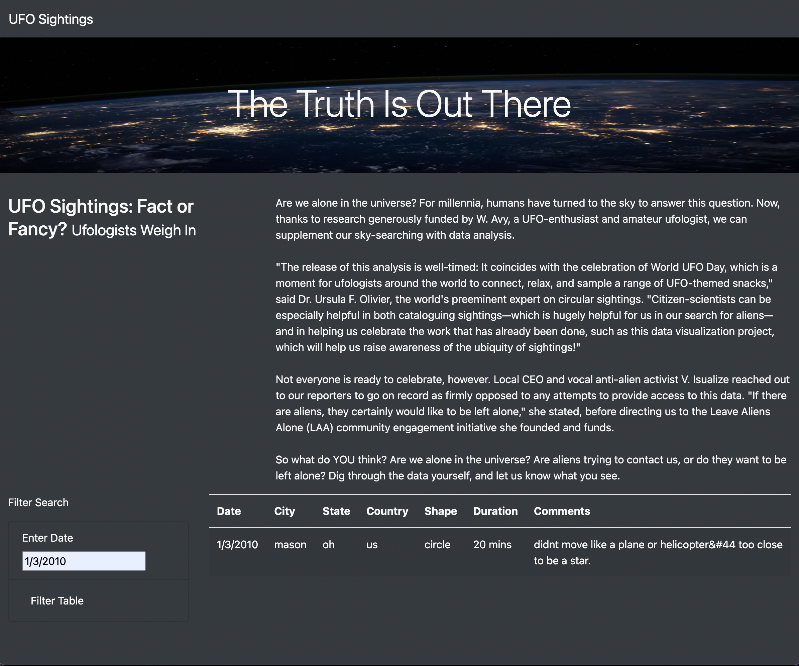
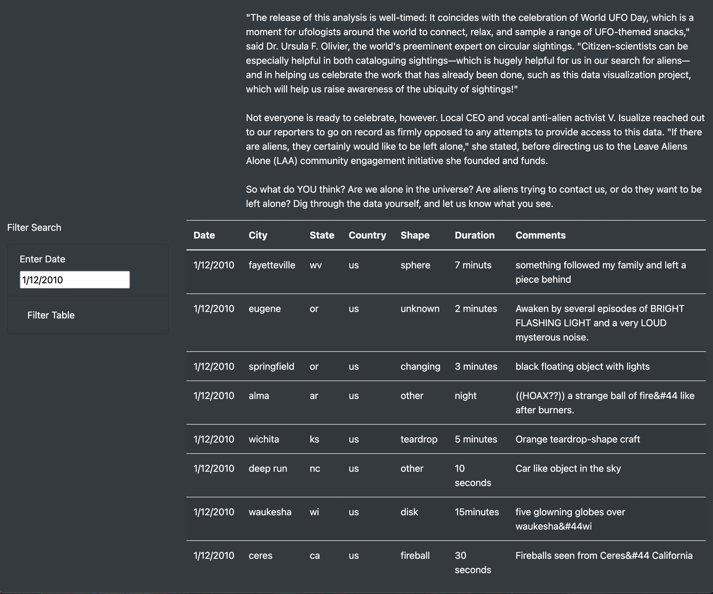

# UFOs

[link to page](http://127.0.0.1:5500/index.html?)

## Overview
The purpose of this analysis is to show and filter gathered data pertaining to UFO sightings over specific dates.

## Results
By entering in a specific date, the table will filter the data to only show sightings from that day.

------------------------------------------------------------------------------------------------------------------------------------------------

------------------------------------------------------------------------------------------------------------------------------------------------

## Summary
It's limitations include not being able to show a range of dates, and that the search function only works by clicking the "Filter" button, rather than hitting the "Enter" or "Return" keys. Accidentally doing this also clears the search bar of the requested date, requiring it to be typed in again. Both of these can be fixed with adjustments to the html coding used to create the webpage.
